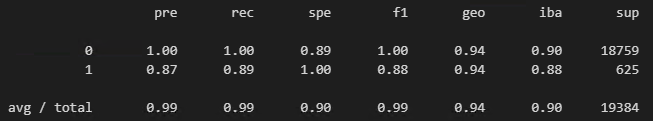
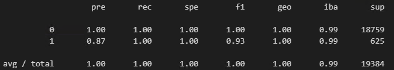

# Module 12 - Supervised Learning

## Overview of the Analysis

The aim of this module's homework is to analyse potential customers borrowing capacity with consideration of their previous history, based on collected data from a p2p lending company. Based on borrowers data, loan size,interest rate, borrower income, debt to income ratio, number of accounts and whether they are a decent person (derogatory_marks) *jokes* 

## Process

The data was separted with loan_status as the label and the remaining columns used as features. I trained a logistic regression model using the source data and reviewed how it performed. I then used RandomOverSampler to resample the data and another logistic regression model was trained using the new data.

## Results

Using bulleted lists, describe the balanced accuracy scores and the precision and recall scores of all machine learning models.

* Machine Learning Model 1

  
Original Data Set

  * Balanced Accuracy Score   : 0.94
  * Healthy Loan Precision    : 1.00
  * High-risk Loan Precision  : 0.87
  * Healthy Loan Recall       : 1.00
  * High-risk Loan Recall     : 0.89

* Machine Learning Model 2

  
Resampled Data Set

  * Balanced Accuracy Score   : 0.99
  * Healthy Loan Precision    : 1.00
  * High-risk Loan Precision  : 0.87
  * Healthy Loan Recall       : 1.00
  * High-risk Loan Recall     : 1.00

## Summary

You can see both models are pretty accurate, but the second is more so - using the resampled data. You can see this with the higher Balanced Accuracy Score and Recall rates.

Performance-wise, it depends on the result we are looking for. The idea is to grade the risk correctly so the source data used for training is vital to get useful information out of the model.

## Back to Fintech Home

* [Fintech Bootcamp Home](https://github.com/d4np3/fintech)
